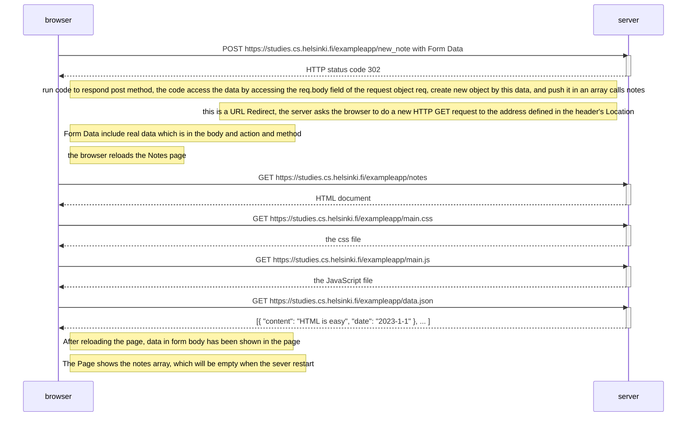

```mermaid
  sequenceDiagram
    participant browser
    participant server

    browser->>server: POST https://studies.cs.helsinki.fi/exampleapp/new_note with Form Data
    activate server
    server-->>browser: HTTP status code 302
    deactivate server
    Note left of server: run code to respond post method, the code access the data by accessing the req.body field of the request object req, create new object by this data, and push it in an array calls notes
    Note left of server: this is a URL Redirect, the server asks the browser to do a new HTTP GET request to the address defined in the header's Location
    Note right of browser: Form Data include real data which is in the body and action and method
    Note right of browser: the browser reloads the Notes page
    
    browser->>server: GET https://studies.cs.helsinki.fi/exampleapp/notes
    activate server
    server-->>browser: HTML document
    deactivate server

    browser->>server: GET https://studies.cs.helsinki.fi/exampleapp/main.css
    activate server
    server-->>browser: the css file
    deactivate server

    browser->>server: GET https://studies.cs.helsinki.fi/exampleapp/main.js
    activate server
    server-->>browser: the JavaScript file
    deactivate server

    browser->>server: GET https://studies.cs.helsinki.fi/exampleapp/data.json
    activate server
    server-->>browser: [{ "content": "HTML is easy", "date": "2023-1-1" }, ... ]
    deactivate server
    Note right of browser: After reloading the page, data in form body has been shown in the page
    Note right of browser: The Page shows the notes array, which will be empty when the sever restart
```
