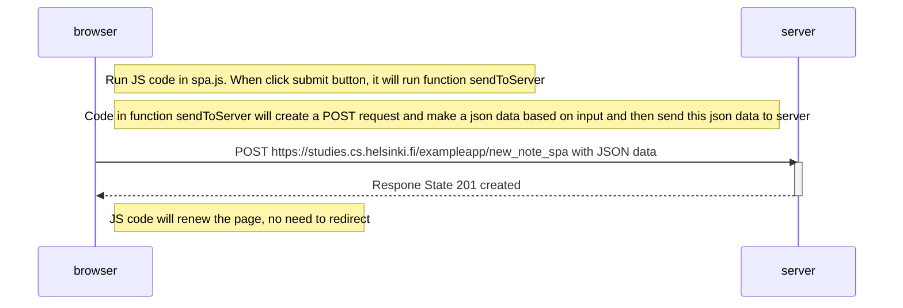

```mermaid
  sequenceDiagram
    participant browser
    participant server
    
    Note right of browser: Run JS code in spa.js. When click submit button, it will run function sendToServer
    Note right of browser: Code in function sendToServer will create a POST request and make a json data based on input and then send this json data to server
    browser->>server: POST https://studies.cs.helsinki.fi/exampleapp/new_note_spa with JSON data
    activate server
    server-->>browser: Respone State 201 created
    deactivate server
    Note right of browser: JS code will renew the page, no need to redirect
```
